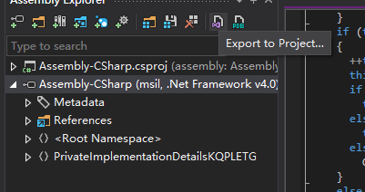
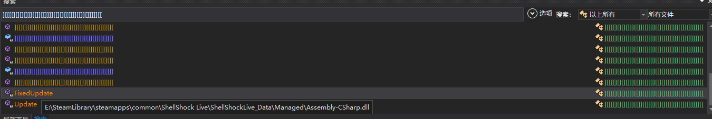
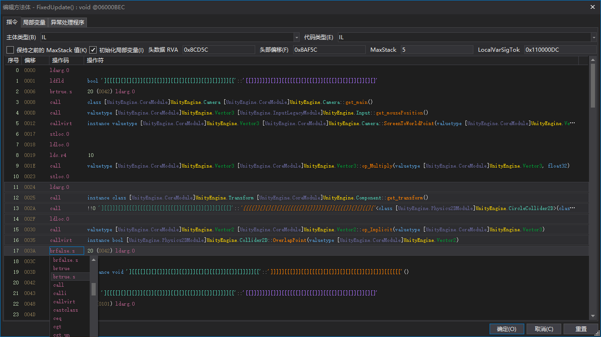

# 如何找到并修改自动捡齿轮

## 你需要的工具

* [dnSpy](https://github.com/dnSpy/dnSpy)
* [dot Peek](https://www.jetbrains.com/decompiler/)

## 1. 寻找齿轮类

1. 打开你的游戏文件夹，找到`ShellShock Live\ShellShockLive_Data\Managed\Assembly-CSharp.dll`，然后用 dotPeek 打开它。
2. 选择`Assembly-CSharp.dll`，然后生成一个新csproj项目，这样我们才能搜索字符串。

   

3. 等待 dotPeek 生成项目，因为需要反编译整个游戏，所以可能需要一些时间。
4. 生成完成后，按`Ctrl+Alt+T`打开字符串搜索框，然后搜索`Shine`，找到其中一个`FixedUpdate`函数。因为有三个函数都是`FixedUpdate`，所以我们需要找到正确的那个。正确的应该长这样

   
   

5. 把类名复制下来。

复制的类名可能是转义的字符，因此你需要把它转换回去。这里我们可以使用python来转换，你只需要在把转义的输入一个字符串里面就会转换为正常的字符串。

## 2. 修改dll

1. 在 dnSpy 中搜索到类后，然后找到`FixedUpdate`函数。

   

2. 在这段代码中将检查鼠标的位置是否和齿轮重叠，如果重叠就捡起来。
    ```csharp
    Vector3 vector = Camera.main.ScreenToWorldPoint(Input.mousePosition);
    vector *= 10f;
    if (base.transform.getSystem<CircleCollider2D>().OverlapPoint(vector))
    {
        this.collectGear();
    }
    ```
3. 我们需要修改这段代码，让它在鼠标不和齿轮重叠时也能捡起来，这里只需要将if的结果取反就可以了。
4. 要做到这一点，我们需要编辑IL代码，因为这逼游戏使用的混淆不支持二次编译。
5. 右键点击`if`语句，然后选择`Edit IL Instructions`。
6. 在弹出的窗口中，将`brfalse.s`改为`brtrue.s`，然后点击`OK`。

   

7. 这时候你应该可以看到`if`语句的结果已经取反了。
8. 现在我们需要保存修改后的dll，按下`Ctrl+Shift+S`，选择一个其他路径保存，然后点击`OK`。
9. 备份原版的`Assembly-CSharp.dll`，然后将修改后的dll覆盖原版的dll。